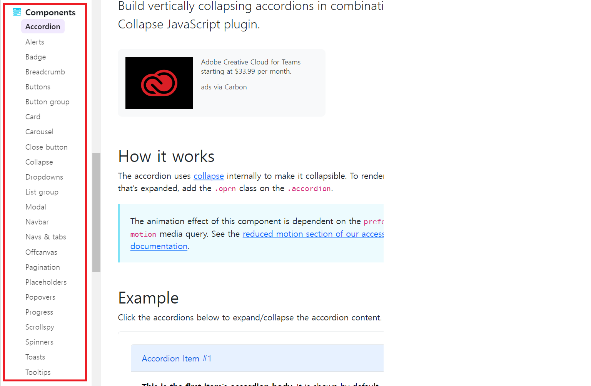
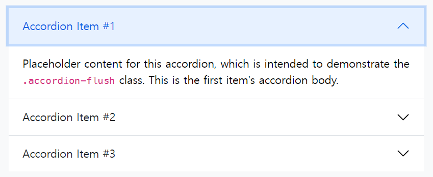
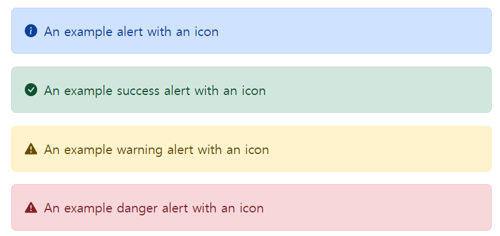
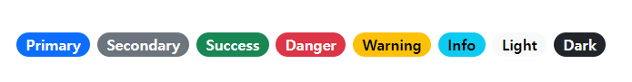
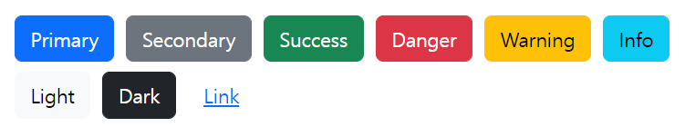
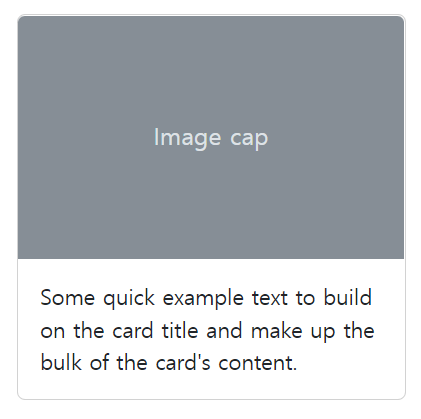
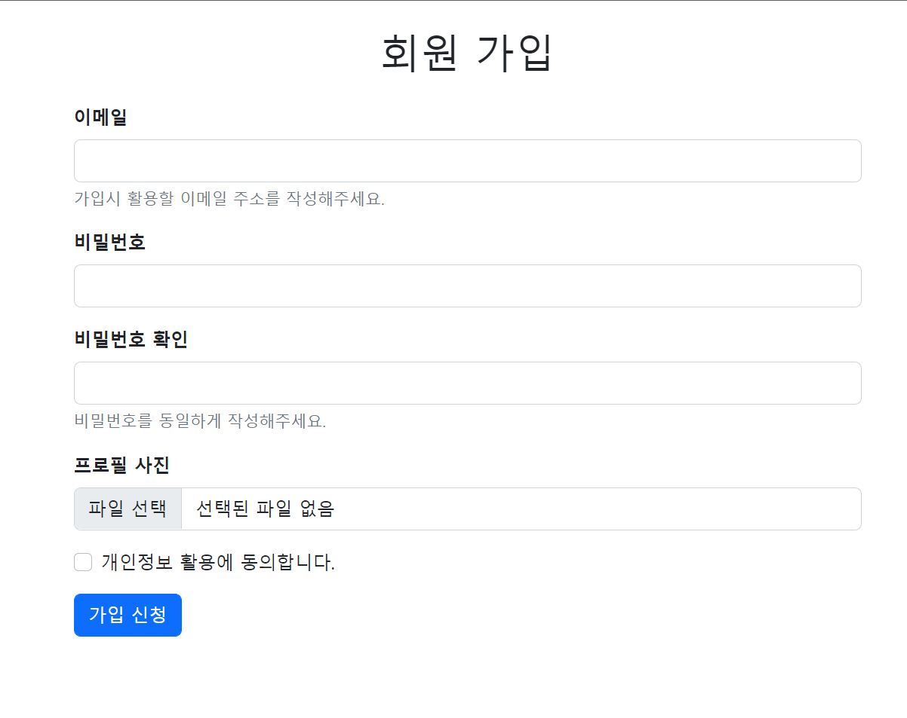
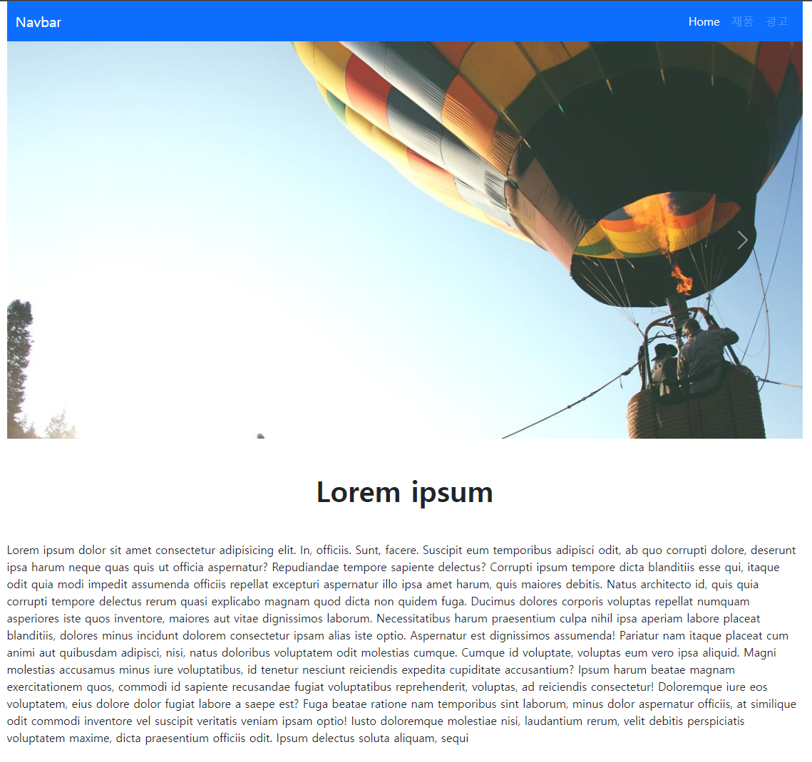

# 9/6

# 🌇 오전

## 🕓 9:00 ~ 12:00

### 🟨 Bootstrap 활용 실습 Review

#### ✅ Review

- 부트스트랩을 쓰고싶을 때 가장 먼저 해야할 것은?

> CSS 땡겨오기! 부트스트랩은 결국 다른 사람들이 미리 만들어 놓은 CSS, JS 파일들임

- 부트스트랩 스니펫 익스텐션 다운받아 활용하면 매우 편해짐 👉 but 얘는 나중에!

<br>

### 🟨 Bootstrap 컴포넌트

#### ✅ Components란?

- Bootstrap의 다양한 UI 요소를 활용할 수 있음
- https://getbootstrap.com/docs/5.2/components/accordion/ 참고!



<br>

### ✅ Accordion

> 클릭 했을 때 어떤 동작이 일어나도록 하는 요소



```html
<div class="accordion" id="accordionExample">
  <div class="accordion-item">
    <h2 class="accordion-header" id="headingOne">
      <button
        class="accordion-button"
        type="button"
        data-bs-toggle="collapse"
        data-bs-target="#collapseOne"
        aria-expanded="true"
        aria-controls="collapseOne"
      >
        Accordion Item #1
      </button>
    </h2>
    <div
      id="collapseOne"
      class="accordion-collapse collapse show"
      aria-labelledby="headingOne"
      data-bs-parent="#accordionExample"
    >
      <div class="accordion-body">
        <strong>This is the first item's accordion body.</strong> It is shown
        by... <code>.accordion-body</code>, though the transition does limit
        overflow.
      </div>
    </div>
  </div>
  <div class="accordion-item">
    <h2 class="accordion-header" id="headingTwo">
      <button
        class="accordion-button collapsed"
        type="button"
        data-bs-toggle="collapse"
        data-bs-target="#collapseTwo"
        aria-expanded="false"
        aria-controls="collapseTwo"
      >
        Accordion Item #2
      </button>
    </h2>
    <div
      id="collapseTwo"
      class="accordion-collapse collapse"
      aria-labelledby="headingTwo"
      data-bs-parent="#accordionExample"
    >
      <div class="accordion-body">
        <strong>This is the second item's accordion body.</strong> It is hidden
        by ...<code>.accordion-body</code>, though the transition does limit
        overflow.
      </div>
    </div>
  </div>
  <div class="accordion-item">
    <h2 class="accordion-header" id="headingThree">
      <button
        class="accordion-button collapsed"
        type="button"
        data-bs-toggle="collapse"
        data-bs-target="#collapseThree"
        aria-expanded="false"
        aria-controls="collapseThree"
      >
        Accordion Item #3
      </button>
    </h2>
    <div
      id="collapseThree"
      class="accordion-collapse collapse"
      aria-labelledby="headingThree"
      data-bs-parent="#accordionExample"
    >
      <div class="accordion-body">
        <strong>This is the third item's accordion body.</strong> It is hidden
        by def...<code>.accordion-body</code>, though the transition does limit
        overflow.
      </div>
    </div>
  </div>
</div>
```

<br>

### ✅ Alerts

> 경고문



```css
<svg xmlns="http://www.w3.org/2000/svg" style="display: none;">
  <symbol id="check-circle-fill" viewBox="0 0 16 16">
    <path d="M16 8A8 8 0 1 1 0 8a8 8 0 0 1 16 0zm-3.97-3.03a.75.75 0 0 0-1.08.022L7.477 9.417 5.384 7.323a.75.75 0 0 0-1.06 1.06L6.97 11.03a.75.75 0 0 0 1.079-.02l3.992-4.99a.75.75 0 0 0-.01-1.05z"/>
  </symbol>
  <symbol id="info-fill" viewBox="0 0 16 16">
    <path d="M8 16A8 8 0 1 0 8 0a8 8 0 0 0 0 16zm.93-9.412-1 4.705c-.07.34.029.533.304.533.194 0 .487-.07.686-.246l-.088.416c-.287.346-.92.598-1.465.598-.703 0-1.002-.422-.808-1.319l.738-3.468c.064-.293.006-.399-.287-.47l-.451-.081.082-.381 2.29-.287zM8 5.5a1 1 0 1 1 0-2 1 1 0 0 1 0 2z"/>
  </symbol>
  <symbol id="exclamation-triangle-fill" viewBox="0 0 16 16">
    <path d="M8.982 1.566a1.13 1.13 0 0 0-1.96 0L.165 13.233c-.457.778.091 1.767.98 1.767h13.713c.889 0 1.438-.99.98-1.767L8.982 1.566zM8 5c.535 0 .954.462.9.995l-.35 3.507a.552.552 0 0 1-1.1 0L7.1 5.995A.905.905 0 0 1 8 5zm.002 6a1 1 0 1 1 0 2 1 1 0 0 1 0-2z"/>
  </symbol>
</svg>

<div class="alert alert-primary d-flex align-items-center" role="alert">
  <svg class="bi flex-shrink-0 me-2" role="img" aria-label="Info:"><use xlink:href="#info-fill"/></svg>
  <div>
    An example alert with an icon
  </div>
</div>
<div class="alert alert-success d-flex align-items-center" role="alert">
  <svg class="bi flex-shrink-0 me-2" role="img" aria-label="Success:"><use xlink:href="#check-circle-fill"/></svg>
  <div>
    An example success alert with an icon
  </div>
</div>
<div class="alert alert-warning d-flex align-items-center" role="alert">
  <svg class="bi flex-shrink-0 me-2" role="img" aria-label="Warning:"><use xlink:href="#exclamation-triangle-fill"/></svg>
  <div>
    An example warning alert with an icon
  </div>
</div>
<div class="alert alert-danger d-flex align-items-center" role="alert">
  <svg class="bi flex-shrink-0 me-2" role="img" aria-label="Danger:"><use xlink:href="#exclamation-triangle-fill"/></svg>
  <div>
    An example danger alert with an icon
  </div>
</div>
```

<br>

### ✅ Badge

> 작은 배지 모양, 카운트나 상태 표시



<br>

### ✅ Buttons

> 클릭 했을 때 어떤 동작이 일어나도록 하는 요소



```css
<button type="button" class="btn btn-primary">Primary</button>
<button type="button" class="btn btn-secondary">Secondary</button>
<button type="button" class="btn btn-success">Success</button>
<button type="button" class="btn btn-danger">Danger</button>
<button type="button" class="btn btn-warning">Warning</button>
<button type="button" class="btn btn-info">Info</button>
<button type="button" class="btn btn-light">Light</button>
<button type="button" class="btn btn-dark">Dark</button>

<button type="button" class="btn btn-link">Link</button>
```

<br>

### ✅ Card

> 실습 때 활용했던것 처럼 이미지와 설명이 같이 있음



```css
<div class="card" style="width: 18rem;">
  
  <div class="card-body">
    <p class="card-text">Some quick example text to build on the card title and make up the bulk of the card's content.</p>
  </div>
</div>
```

<br>

# 🌆 오후

## 🕓 1:00 ~ 6:00

### 🟨 실습

- 추가 참고 자료

  https://icons.getbootstrap.com/

  https://animate.style/

- 실습 진행

  👉 [README 파일](./Practice/220906/README.md)

  👉 [실습 1](./Practice/220906/practice1.html)

  
  
  👉 [실습 2](./Practice/220906/practice2.html)
  
  
