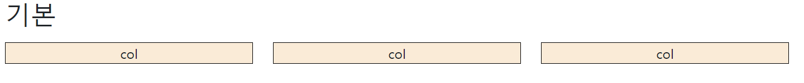
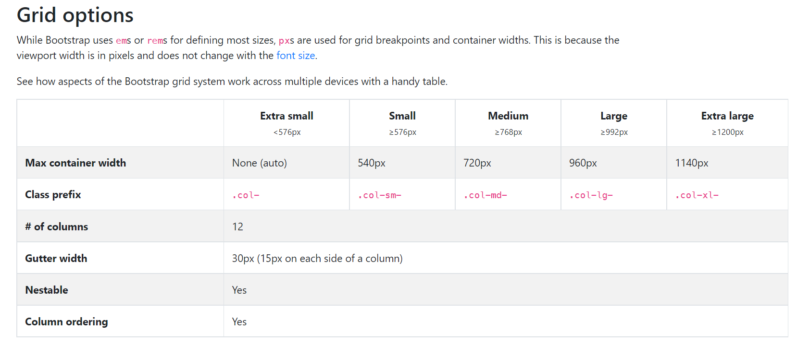

# 9/7

# 🌇 오전

## 🕓 9:00 ~ 12:00

### 🟨실습 Review

#### ✅ Review

<br>

### 🟨 Bootstrap Grid System

#### ✅ Grid System 이란?

- 요소들의 디자인과 배치에 도움을 주는 시스템
- 기본 요소
  - Column : 실제 컨텐츠를 포함하는 부분
  - Gutter : 컬럼과 컬럼 사이의 공간 (사이 간격)
  - Container : 컬럼들을 담고 있는 공간
- 보통 12 column이나 16 column grid 👉 배수 활용해서 다양하게 배치하기 위해!
- `flexbox`를 사용
- container, rows, column으로 컨텐츠를 배치하고 정렬
- 반드시 기억해야 할 2가지!

> 12개의 column과 6개의 grid breakpoints

<br>

#### ✅ Grid System 기본 코드

```html
<div class="row my-3">
  <div class="col"><div class="box">col</div></div>
  <div class="col"><div class="box">col</div></div>
  <div class="col"><div class="box">col</div></div>
</div>
```



> 전체가 12개의 column이고 3개의 col을 박스로 썼으므로 하나 당 4개 컬럼의 양을 차지하는 모양을 가짐

<br>

#### ✅ Grid System breakpoints



> 각 class의 설정된 `Max container width`이 따라서 수평정렬 상태에서 수직정렬 상태로 변함

- col-lg- : 기본적인 상태 (데스크탑 뷰)
- col-md- : 기본보다 작은 상태 (태블릿 뷰)
- col-sm- : md보다 작아진 상태 (스마트폰 뷰)
- col- : 576px 보다 작은 모든 경우

<br>

# 🌆 오후

## 🕓 1:00 ~ 6:00

### 🟨 실습

- [실습파일](./Practice/220907/prac.html)

