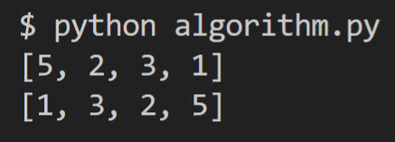

# 📕나동빈 알고리즘

## ✔️1차시 : 스택 & 큐

### ✅ 스택(Stack)

#### 🟨 스택

- 먼저 들어온 데이터가 나중에 나가는 `선입후출`의 자료구조

- 입구와 출구가 동일한 형태

  ```python
  stack = []
  
  # 삽입(5) -> 삽입(2) -> 삽입(3) ->삽입(7) -> 삭제() -> 삽입(1)
  # -> 삽입 (4) -> 삭제()
  stack.append(5)
  stack.append(2)
  stack.append(3)
  stack.append(7)
  stack.pop()
  stack.append(1)
  stack.append(4)
  stack.pop()
  
  print(stack)
  print(stack[::-1])
  ```

  

> stack을 그대로 출력하면 5, 2, 3, 1 순서이고 [::-1] (마이너스 스텝)을 활용하면 거꾸로 데이터를 다룰 수 있음

<br>


### ✅ 큐(Queue)

#### 🟨 큐

- 먼저 들어온 데이터가 먼저 나가는 `선입선출`의 자료구조

- 입구가 출구가 모두 뚫려 있는 터널, 대기열과 같은 형태

  ```python
  from collections import deque
  
  # 큐 구현을 위해 deque 라이브러리 활용
  queue = deque()
  
  # 삽입(5) -> 삽입(2) -> 삽입(3) ->삽입(7) -> 삭제() -> 삽입(1)
  # -> 삽입 (4) -> 삭제()
  queue.append(5)
  queue.append(2)
  queue.append(3)
  queue.append(7)
  queue.popleft()
  queue.append(1)
  queue.append(4)
  queue.popleft()
  
  print(queue)
  queue.reverse()
  print(queue)
  ```

  

  > queue에서는 pop이 아니라 popleft사용
  >
  > 거꾸로 출력하고 싶으면 reverse 메서드 사용

<br>


## ✔️ 2차시 : 우선순위 큐

### ✅ 우선순위 큐(Priority Queue)

#### 🟨 우선순위 큐

- 우선순위가 가장 높은 데이터를 가장 먼저 삭제하는 자료구조
- 물건 데이터를 자료구조에 넣었다가 가치가 높은 물건부터 꺼내서 확인해야 하는 경우 같을 때 사용

<br>


### ✅ ORDER BY

- - 


